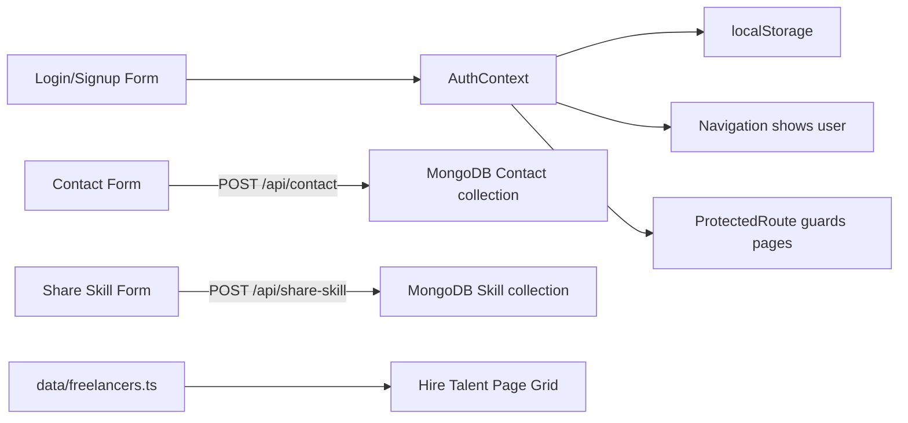

# 🔍 SkillSync – Complete Codebase Analysis

> **Project**: SkillSync – Online Skill Sharing & Hiring Platform  
> **Live URL**: `skill-sync-jiofar7n2-deepkabariya2308-1876s-projects.vercel.app`  
> **Analysis Date**: April 15, 2026

---

## 1. PROJECT STRUCTURE

```
SkillSync/
├── .git/                          # Git version control
├── .gitignore                     # Ignores node_modules, .env*, .next/, etc.
├── .next/                         # Next.js build output (generated)
├── README.md                      # Project overview, features, tech stack summary
├── components.json                # shadcn/ui configuration (new-york style, RSC enabled)
├── next-env.d.ts                  # Next.js TypeScript declarations (auto-generated)
├── next.config.mjs                # Next.js config: ignores TS errors, unoptimized images
├── package.json                   # Dependencies, scripts (dev/build/lint/start)
├── package-lock.json              # Locked dependency tree (npm)
├── pnpm-lock.yaml                 # Placeholder/empty pnpm lockfile
├── postcss.config.mjs             # PostCSS config using @tailwindcss/postcss plugin
├── tsconfig.json                  # TypeScript config: strict, ES6, bundler resolution
│
├── app/                           # Next.js App Router (pages + API routes)
│   ├── globals.css                # Primary global CSS: custom theme tokens, v0 watermark removal
│   ├── layout.tsx                 # Root layout: fonts, AuthProvider wrapper, v0 watermark removal script
│   ├── page.tsx                   # Home page: hero, features, how-it-works, testimonials, CTA
│   ├── about/
│   │   └── page.tsx               # About page: mission, stats, benefits, trust factors
│   ├── contact/
│   │   └── page.tsx               # Contact page: form that POSTs to /api/contact (real API)
│   ├── hire-talent/
│   │   ├── loading.tsx            # Loading state placeholder (returns null)
│   │   └── page.tsx               # Hire Talent page: freelancer grid with ProtectedRoute
│   ├── login/
│   │   └── page.tsx               # Login page: email/password form, OAuth stubs, mock auth
│   ├── post-project/
│   │   └── page.tsx               # Post Project page: multi-step form with pricing UI, ProtectedRoute
│   ├── services/
│   │   └── page.tsx               # Services page: freelancer categories, AI matching details
│   ├── share-skill/
│   │   └── page.tsx               # Share Skill page: experts-only form, POSTs to /api/share-skill
│   ├── signup/
│   │   └── page.tsx               # Signup page: full registration form, role selection, mock auth
│   └── api/                       # Next.js API Routes (server-side)
│       ├── auth/
│       │   └── callback/          # Empty directory (leftover from Supabase integration)
│       ├── contact/
│       │   └── route.ts           # POST handler: validates & saves contact to MongoDB
│       └── share-skill/
│           └── route.ts           # POST handler: validates & saves skill listing to MongoDB
│
├── components/                    # Shared React components
│   ├── animated-section.tsx       # IntersectionObserver-based scroll animations
│   ├── footer.tsx                 # Site footer with links and social icons
│   ├── hero-buttons.tsx           # Home hero CTA buttons with demo modal
│   ├── navigation.tsx             # Main nav: desktop/mobile, auth-aware, user dropdown
│   ├── ProtectedRoute.tsx         # Auth guard: redirects unauthenticated users to /login
│   ├── theme-provider.tsx         # next-themes provider wrapper (NOT currently used in layout)
│   └── ui/                        # shadcn/ui component library (57 files)
│       ├── accordion.tsx          ├── alert-dialog.tsx      ├── alert.tsx
│       ├── aspect-ratio.tsx       ├── avatar.tsx            ├── badge.tsx
│       ├── breadcrumb.tsx         ├── button-group.tsx      ├── button.tsx
│       ├── calendar.tsx           ├── card.tsx              ├── carousel.tsx
│       ├── chart.tsx              ├── checkbox.tsx          ├── collapsible.tsx
│       ├── command.tsx            ├── context-menu.tsx      ├── dialog.tsx
│       ├── drawer.tsx             ├── dropdown-menu.tsx     ├── empty.tsx
│       ├── field.tsx              ├── form.tsx              ├── hover-card.tsx
│       ├── input-group.tsx        ├── input-otp.tsx         ├── input.tsx
│       ├── item.tsx               ├── kbd.tsx               ├── label.tsx
│       ├── menubar.tsx            ├── navigation-menu.tsx   ├── pagination.tsx
│       ├── popover.tsx            ├── progress.tsx          ├── radio-group.tsx
│       ├── resizable.tsx          ├── scroll-area.tsx       ├── select.tsx
│       ├── separator.tsx          ├── sheet.tsx             ├── sidebar.tsx
│       ├── skeleton.tsx           ├── slider.tsx            ├── sonner.tsx
│       ├── spinner.tsx            ├── switch.tsx            ├── table.tsx
│       ├── tabs.tsx               ├── textarea.tsx          ├── toast.tsx
│       ├── toaster.tsx            ├── toggle-group.tsx      ├── toggle.tsx
│       ├── tooltip.tsx            ├── use-mobile.tsx        └── use-toast.ts
│
├── context/                       # React Context providers
│   └── AuthContext.tsx            # Auth state: user, login, signup, logout (localStorage-based)
│
├── data/                          # Static/mock data
│   └── freelancers.ts             # Hardcoded array of 4 freelancer profiles
│
├── hooks/                         # Custom React hooks
│   ├── use-mobile.ts              # Mobile breakpoint detection (768px)
│   ├── use-toast.ts               # Toast notification system (reducer-based)
│   └── useAuth.ts                 # Convenience re-export of useAuth from AuthContext
│
├── lib/                           # Utility libraries and connections
│   ├── constants.ts               # Empty file (data moved to /data folder)
│   ├── mongodb.ts                 # Mongoose connection with caching (reads MONGODB_URI from env)
│   ├── supabase/                  # Empty directory (leftover from previous Supabase integration)
│   └── utils.ts                   # cn() utility for merging Tailwind classes
│
├── models/                        # Mongoose data models
│   ├── Contact.ts                 # Schema: firstName, lastName, email, message, createdAt
│   └── Skill.ts                   # Schema: title, category, experience, rate, description, portfolioUrl
│
├── public/                        # Static assets (17 files)
│   ├── alex-rivera.jpg            # Freelancer portrait
│   ├── apple-icon.png             # Apple touch icon
│   ├── elena-chen.jpg             # Freelancer portrait
│   ├── icon-dark-32x32.png        # Dark favicon
│   ├── icon-light-32x32.png       # Light favicon
│   ├── icon.svg                   # SVG favicon
│   ├── marcus-thorne.jpg          # Freelancer portrait (unused)
│   ├── placeholder-logo.png/svg   # Logo placeholders
│   ├── placeholder-user.jpg       # Default user avatar
│   ├── placeholder.jpg/svg        # Generic placeholders
│   ├── professional-designer-portrait.png    # Used in freelancers data
│   ├── professional-developer-portrait.png   # Used in freelancers data
│   ├── professional-man-scientist-portrait.jpg   # Used in freelancers data
│   ├── professional-man-strategist-portrait.jpg  # Used in freelancers data
│   └── sofia-rossi.jpg            # Freelancer portrait (unused)
│
├── scripts/                       # Empty directory
│
└── styles/
    └── globals.css                # Secondary global CSS (default shadcn theme, NOT used by app)
```

---

## 2. TECH STACK

### Frontend
| Technology | Version | Purpose |
|---|---|---|
| **Next.js** | 15.5.15 | React framework (App Router) |
| **React** | 19.2.0 | UI library |
| **TypeScript** | ^5 | Type safety |
| **Tailwind CSS** | 4.1.9 | Utility-first CSS framework |
| **tw-animate-css** | 1.3.3 | Tailwind animation utilities |
| **shadcn/ui (Radix UI)** | Various | 57 accessible UI primitives (new-york style) |
| **Lucide React** | 0.454.0 | Icon library |
| **next-themes** | 0.4.6 | Dark/light mode (installed but NOT wired in layout) |
| **Sonner** | 1.7.4 | Toast notifications (installed, not primary – custom toast used) |
| **class-variance-authority** | 0.7.1 | Component variant management |
| **clsx + tailwind-merge** | — | Class merging utilities |

### Backend
| Technology | Version | Purpose |
|---|---|---|
| **Next.js API Routes** | — | Server-side endpoints (contact, share-skill) |
| **Mongoose** | 9.0.2 | MongoDB ODM |
| **MongoDB** | 7.0.0 | MongoDB driver |

### Form / Validation
| Technology | Purpose |
|---|---|
| **react-hook-form** | Form handling (installed, not actively used) |
| **zod** | Schema validation (installed, not actively used) |
| **@hookform/resolvers** | Zod integration for react-hook-form (installed, not actively used) |

### Additional Libraries (installed but not used in visible code)
| Library | Purpose |
|---|---|
| **recharts** | Charts/data visualization (installed, not visibly used) |
| **embla-carousel-react** | Carousel functionality (for shadcn carousel component) |
| **react-resizable-panels** | Resizable panel layouts (for shadcn resizable component) |
| **vaul** | Drawer component (for shadcn drawer) |
| **date-fns + react-day-picker** | Date picker functionality (for shadcn calendar) |
| **input-otp** | OTP input (for shadcn input-otp, leftover from Supabase auth) |
| **cmdk** | Command palette (for shadcn command component) |

### Hosting / Deployment
| Service | Details |
|---|---|
| **Vercel** | Deployed via Vercel; `@vercel/analytics` included in dependencies |
| **Live URL** | `skill-sync-jiofar7n2-deepkabariya2308-1876s-projects.vercel.app` |

### Third-Party APIs / Services
| Service | Status |
|---|---|
| **MongoDB Atlas** | Connected via `MONGODB_URI` env variable (Mongoose) |
| **Supabase** | **Removed** — empty `lib/supabase/` dir and `api/auth/callback/` are leftover artifacts |
| **Google OAuth** | UI buttons exist, but marked "not available in static mode" |
| **Facebook OAuth** | UI buttons exist, but marked "not available in static mode" |

---

## 3. PAGES AND ROUTES

### Frontend Routes

| Route | File | Auth Required | Description |
|---|---|---|---|
| `/` | `app/page.tsx` | No | **Home** — Hero section, features grid, how-it-works, testimonials, CTA |
| `/about` | `app/about/page.tsx` | No | **About** — Mission, statistics (mock: 50K+ users, 25K+ projects), benefits, trust factors |
| `/services` | `app/services/page.tsx` | No | **Services** — 6 freelancer categories, AI matching explainer, CTA |
| `/contact` | `app/contact/page.tsx` | No | **Contact** — Form with real API POST to MongoDB |
| `/login` | `app/login/page.tsx` | No | **Login** — Email/password form, OAuth buttons, mock authentication |
| `/signup` | `app/signup/page.tsx` | No | **Signup** — Full registration with role selection (Learner/Expert) |
| `/hire-talent` | `app/hire-talent/page.tsx` | **Yes** | **Hire Talent** — Freelancer grid with search/filter UI, "Hire" buttons |
| `/post-project` | `app/post-project/page.tsx` | **Yes** | **Post Project** — Multi-step project posting form with pricing estimate |
| `/share-skill` | `app/share-skill/page.tsx` | **Yes** (Expert only) | **Share Skill** — Skill listing form, real API POST to MongoDB |

### API Routes

| Endpoint | Method | File | Description |
|---|---|---|---|
| `/api/contact` | POST | `app/api/contact/route.ts` | Validates & saves contact form to MongoDB |
| `/api/share-skill` | POST | `app/api/share-skill/route.ts` | Validates & saves skill listing to MongoDB |

### Navigation Structure
```
Desktop:  Home | About | Services | Hire Talent | Post Project | Contact | [Share Skill]*
                                                                          | [Login/Signup OR User Avatar]

Mobile:   Hamburger Menu → Same links stacked vertically

* Share Skill only visible when logged in as "expert" role
```

### Missing/Broken Routes
- `/forgot-password` — Linked from login page but **page does not exist** (404)
- `/terms` — Linked from footer and signup but **page does not exist** (404)
- `/privacy` — Linked from footer and signup but **page does not exist** (404)

---

## 4. COMPONENTS

### Custom Components

| Component | File | Description | Used In |
|---|---|---|---|
| `Navigation` | `components/navigation.tsx` | Sticky navbar, desktop/mobile responsive, auth-aware (shows user dropdown or login/signup buttons), conditional "Share Skill" link for experts | **Every page** |
| `Footer` | `components/footer.tsx` | 4-column footer with branding, quick links, legal links, social icons | **Every page** |
| `AnimatedSection` | `components/animated-section.tsx` | Scroll-triggered animations using IntersectionObserver (fadeIn, slideUp, slideInLeft, slideInRight) | **Every page** |
| `HeroButtons` | `components/hero-buttons.tsx` | "Get Started" and "Watch Demo" buttons with demo modal placeholder | Home page only |
| `ProtectedRoute` | `components/ProtectedRoute.tsx` | Auth guard wrapper — redirects to `/login` if not authenticated | Hire Talent, Post Project, Share Skill |
| `ThemeProvider` | `components/theme-provider.tsx` | Wrapper for `next-themes` provider | **Not used** (imported but never rendered in layout) |

### Reusable Components (cross-page usage)

| Component | Pages Used |
|---|---|
| `Navigation` | All 8 pages |
| `Footer` | All 8 pages |
| `AnimatedSection` | All 8 pages |
| `ProtectedRoute` | Hire Talent, Post Project, Share Skill |
| `Card` / `Badge` / `Button` | All pages |
| `Input` / `Label` / `Select` | Login, Signup, Contact, Post Project, Share Skill |
| `Avatar` | Navigation, Hire Talent |
| `DropdownMenu` | Navigation |
| `Separator` | Login, Signup |
| `Textarea` | Contact, Share Skill |

### shadcn/ui Components (57 files, many unused)

> [!NOTE]
> Only ~15 of the 57 shadcn/ui components are actively used across pages. The rest were bulk-installed and are available but currently unused (e.g., accordion, calendar, chart, carousel, command, context-menu, drawer, menubar, pagination, resizable, sidebar, slider, tabs, toggle, etc.)

---

## 5. FEATURES – STATUS

### ✅ Fully Functional

| Feature | Details |
|---|---|
| **Home page** | Complete landing page with hero, features, how-it-works, testimonials, CTA |
| **About page** | Mission, stats, benefits, trust factors — all UI complete |
| **Services page** | 6 category cards, AI matching explainer — all UI complete |
| **Navigation** | Desktop/mobile menu, auth-aware, user dropdown with logout |
| **Scroll animations** | IntersectionObserver-based fade/slide animations on all pages |
| **Contact form → MongoDB** | Real API: validates form data, saves to MongoDB via Mongoose |
| **Share Skill form → MongoDB** | Real API: validates skill data, saves to MongoDB via Mongoose |
| **Local auth (mock)** | Login/signup saves user to localStorage, auth state persists across sessions |
| **Route protection** | ProtectedRoute redirects non-authenticated users to login |
| **Role-based access** | "Share Skill" page restricted to "expert" role; "learner" sees access denied message |
| **Responsive layout** | All pages mobile-friendly via sticky nav hamburger + Tailwind responsive classes |
| **Freelancer grid** | 4 hardcoded freelancer cards with images, ratings, skills, "Hire" button |

### ⚠️ Partially Done / UI-Only

| Feature | What Exists | What's Missing |
|---|---|---|
| **Login** | Full UI with email/password form, Google/Facebook buttons | No real authentication — mock login only. OAuth says "not available in static mode" |
| **Signup** | Full UI with name, email, role, password, terms checkbox | No real user creation — just saves to localStorage |
| **Post Project form** | Multi-step UI: upload area, duration, expertise dropdown, pricing estimate | No form submission handler, no API integration, pricing locked at $0 |
| **Hire Talent search/filter** | Search input + Filter button visible | Search and filter are non-functional (no state wired, no event handlers) |
| **Hire button** | Appears on each freelancer card | No action on click (no handler) |
| **Watch Demo** | Button opens modal | Modal shows "Video Demo Placeholder" — no actual video |
| **Dark mode** | `ThemeProvider` exists, `.dark` CSS variables defined | Provider is NOT wired in `layout.tsx` — dark mode is inert |
| **Toast notifications** | Custom toast system fully built | Works only in login/signup/contact/share-skill; inconsistent with Sonner (both installed) |

### ❌ Completely Missing (Referenced but Not Built)

| Feature | Where Referenced |
|---|---|
| **Forgot password** | Linked from login page (`/forgot-password`) — page doesn't exist |
| **Terms of Service** | Linked from footer + signup (`/terms`) — page doesn't exist |
| **Privacy Policy** | Linked from footer + signup (`/privacy`) — page doesn't exist |
| **User profile / dashboard** | No profile page exists; no way to view/edit account |
| **Real authentication** | No Supabase/Firebase/NextAuth integration; no JWT/session management |
| **AI Matching** | Heavily marketed in copy but no ML/AI code exists |
| **Escrow / Payments** | Mentioned in copy but zero payment integration |
| **Messaging / Chat** | No communication features between users |
| **Review / Rating system** | Hardcoded star ratings on freelancer cards; no actual review submission |
| **OAuth (Google/Facebook)** | Buttons exist but show "not available" toast |
| **File upload** | Upload areas in Post Project are visual-only (no file handling) |
| **Supabase auth callback** | Empty `api/auth/callback/` directory (leftover from removed integration) |

---

## 6. STATE MANAGEMENT

### Approach: **React Context + `useState` + localStorage**

| State | Scope | Mechanism | Location |
|---|---|---|---|
| **Auth state** (user, isAuthenticated) | Global | React Context + localStorage persistence | `context/AuthContext.tsx` |
| **Mobile menu open/close** | Navigation component | `useState` | `components/navigation.tsx` |
| **Login form fields** | Login page | `useState` | `app/login/page.tsx` |
| **Signup form fields** | Signup page | `useState` | `app/signup/page.tsx` |
| **Contact form fields** | Contact page | `useState` | `app/contact/page.tsx` |
| **Share Skill form fields** | Share Skill page | `useState` | `app/share-skill/page.tsx` |
| **Loading states** | Per-page | `useState` | Various pages |
| **Show password toggle** | Login/Signup | `useState` | Login/Signup pages |
| **Demo modal visibility** | Home hero | `useState` | `components/hero-buttons.tsx` |
| **Scroll animation visibility** | Per-section | `useState` + IntersectionObserver | `components/animated-section.tsx` |
| **Toast notifications** | Global (module-level) | Custom reducer pattern (non-React-Context) | `hooks/use-toast.ts` |

### Global State

Only **one global state** exists: the **AuthContext** providing `user`, `isAuthenticated`, `login()`, `signup()`, and `logout()`. All other state is local to individual components/pages.

> [!WARNING]
> The `User` type is minimal (`{ name: string, role: "learner" | "expert" }`). There is no email, user ID, or token stored—making it inadequate for a real auth system.

---

## 7. API / DATA

### Real API Calls

| Endpoint | Called From | What It Does |
|---|---|---|
| `POST /api/contact` | `app/contact/page.tsx` | Saves contact form submissions to MongoDB |
| `POST /api/share-skill` | `app/share-skill/page.tsx` | Saves skill listing submissions to MongoDB |

### Mock / Dummy Data

| Data | Location | How It's Used |
|---|---|---|
| **Freelancer profiles** (4 entries) | `data/freelancers.ts` | Rendered on the Hire Talent page as cards |
| **Testimonials** (3 entries) | Hardcoded in `app/page.tsx` | Displayed on home page |
| **Statistics** (50K+ users, 25K+ projects, 4.9 rating, 98% success) | Hardcoded in `app/about/page.tsx` | Displayed on About page |
| **Service categories** (6 categories with counts) | Hardcoded in `app/services/page.tsx` | Displayed on Services page |
| **Auth/Login** | `app/login/page.tsx` | Mock login: accepts any email/password, sets name from email prefix |

### Data Flow



---

## 8. AUTHENTICATION

### Current Implementation: **Simulated (localStorage-based mock)**

| Aspect | Details |
|---|---|
| **Mechanism** | React Context stores `{ name, role }` in state + `localStorage` |
| **Login** | Accepts any email/password; extracts name from email prefix; sets role to "expert" |
| **Signup** | Collects name, email, role, password; saves name + role to localStorage (password discarded) |
| **Session persistence** | `localStorage` key `skillSyncUser` — persists across page refreshes |
| **Logout** | Clears localStorage and React state |
| **Route protection** | `ProtectedRoute` component checks `isAuthenticated`; redirects to `/login` if false |
| **Role-based access** | Navigation conditionally shows "Share Skill" for experts; Share Skill page blocks learners |
| **OAuth** | Google/Facebook buttons exist but show "not available in static mode" toast |
| **JWT / Session tokens** | ❌ None |
| **Password hashing** | ❌ None (password is never stored or verified) |
| **Email verification** | ❌ None |
| **Supabase** | Previously attempted, now removed (empty directories remain) |

> [!CAUTION]
> **This is NOT real authentication.** Anyone can "log in" with any credentials. There is no user database, no password verification, and no secure session management.

---

## 9. DATABASE / BACKEND CONNECTION

### What Exists

| Component | Status |
|---|---|
| **MongoDB connection** | `lib/mongodb.ts` — Full Mongoose connection with caching, reads `MONGODB_URI` from `.env.local` |
| **Contact model** | `models/Contact.ts` — Mongoose schema for contact form submissions |
| **Skill model** | `models/Skill.ts` — Mongoose schema for skill listings |
| **Contact API** | `app/api/contact/route.ts` — Validates and saves contacts to MongoDB |
| **Share Skill API** | `app/api/share-skill/route.ts` — Validates and saves skills to MongoDB |

### What's Missing (Needs to Be Built)

| Component | Priority | Description |
|---|---|---|
| **User model** | 🔴 Critical | No User schema exists — needed for real authentication |
| **Auth API routes** | 🔴 Critical | No signup/login/logout API endpoints; no password handling |
| **Session / JWT management** | 🔴 Critical | No server-side session or token-based auth |
| **Project model** | 🟡 High | No schema for posted projects |
| **Project API** | 🟡 High | Post-project form has no backend endpoint |
| **Review / Rating model** | 🟡 High | No schema for reviews/ratings |
| **User-Skill relationship** | 🟡 High | Skills are saved without user association |
| **Freelancer API** | 🟡 High | Currently hardcoded; needs dynamic data from DB |
| **Search/Filter API** | 🟠 Medium | Hire Talent search/filter UI exists but has no backend |
| **File upload** | 🟠 Medium | Post-project upload area is visual-only |
| **Messaging API** | 🟠 Medium | No communication between users |
| **Payment integration** | 🔵 Lower | Escrow/payment mentioned but not started |

---

## 10. STYLING

### Approach: **Tailwind CSS 4.1.9** with CSS Variables

| Aspect | Details |
|---|---|
| **Framework** | Tailwind CSS v4 via `@tailwindcss/postcss` plugin |
| **Animations** | `tw-animate-css` for Tailwind animation utilities + custom IntersectionObserver animations |
| **Component styling** | shadcn/ui's `class-variance-authority` (CVA) pattern |
| **Class merging** | `cn()` utility using `clsx` + `tailwind-merge` |
| **Design tokens** | CSS custom properties in `globals.css` (oklch color space) |
| **Fonts** | Geist Sans + Geist Mono (loaded via `next/font/google`) |

### Design System / Theme

| Token | Light Mode | Description |
|---|---|---|
| `--primary` | `oklch(0.55 0.18 252)` | SkillSync Blue (#007BFF) |
| `--secondary` | `oklch(0.75 0.12 165)` | SkillSync Green (#20C997) |
| `--accent` | Same as secondary | Green accent |
| `--background` | White | Page background |
| `--foreground` | Dark | Text color |
| `--muted` | Light gray | Section backgrounds |
| `--destructive` | Red | Error states |

> [!NOTE]
> Dark mode CSS variables are **fully defined** in `.dark` class, but the `ThemeProvider` is not wired into `layout.tsx`, so dark mode cannot be activated by users.

### Inconsistencies
- **Two `globals.css` files** exist: `app/globals.css` (actively used, customized theme) and `styles/globals.css` (default shadcn theme, unused/orphaned)
- **Contact page** uses hardcoded hex colors (`#FDF5F2`, `#FF7F50`, `#2D2D2D`) instead of theme tokens
- **Post Project page** uses hardcoded hex colors (`#FFFBF0`, `#FF7F50`, `#1A1A1A`) instead of theme tokens
- **Share Skill page** uses hardcoded bg color (`#F8F9FA`)

---

## 11. KNOWN ISSUES & INCOMPLETE PARTS

### 🔴 Critical Issues

| Issue | Location | Details |
|---|---|---|
| Fake authentication | `context/AuthContext.tsx` | No real auth — anyone can "login" with any credentials |
| No user database | — | User model doesn't exist; users aren't persisted |
| Skills saved without user link | `api/share-skill/route.ts` | Skills are orphaned documents, not linked to any user |
| TypeScript errors suppressed | `next.config.mjs` | `ignoreBuildErrors: true` masks real type issues |

### 🟡 Missing Pages (404 links)

| Broken Link | Linked From |
|---|---|
| `/forgot-password` | Login page |
| `/terms` | Footer, Signup page |
| `/privacy` | Footer, Signup page |
| `/avatars/01.png` | Navigation (user avatar image) — file doesn't exist |

### 🟠 Non-functional UI Elements

| Element | Location | Issue |
|---|---|---|
| Search input | Hire Talent | No state or event handler |
| Filter button | Hire Talent | No filter logic |
| "Hire" buttons | Hire Talent | No click handler |
| File upload area | Post Project | Visual-only, no upload logic |
| "Analyze with AI" button | Post Project | No handler |
| Pricing estimate | Post Project | Stuck at $0 |
| "Post Project" submit button | Post Project | No form submission handler |
| "Level comparison guide" link | Post Project | Non-functional `cursor-pointer` span |
| "Watch Demo" modal | Home hero | Shows placeholder text instead of video |
| Social media links | Footer, Contact | All point to `#` |

### 🔵 Leftover / Cleanup Items

| Item | Description |
|---|---|
| `lib/supabase/` | Empty directory from removed Supabase integration |
| `app/api/auth/callback/` | Empty directory from removed Supabase integration |
| `lib/constants.ts` | File only contains a comment: "data has been moved to /data folder" |
| `scripts/` directory | Empty directory |
| `styles/globals.css` | Orphaned/unused CSS file (duplicate of `app/globals.css`) |
| `pnpm-lock.yaml` | Empty/placeholder file (project uses npm) |
| v0 watermark removal | `layout.tsx` + `globals.css` | Aggressive v0.dev watermark removal (JS + CSS) reveals this was built with v0 |
| Duplicate toast implementations | `hooks/use-toast.ts` and `components/ui/use-toast.ts` are identical |
| Duplicate mobile hooks | `hooks/use-mobile.ts` and `components/ui/use-mobile.tsx` are identical |
| Package name | `package.json` has name `"my-v0-project"` instead of `"skillsync"` |

### ⚠️ No TODO/FIXME Comments

No `TODO`, `FIXME`, or `HACK` comments found anywhere in the codebase.

---

## 12. ENVIRONMENT VARIABLES

| Variable | Referenced In | Required | Purpose |
|---|---|---|---|
| `MONGODB_URI` | `lib/mongodb.ts` | **Yes** (for API routes) | MongoDB Atlas connection string |

> [!IMPORTANT]
> This is the **only** environment variable in the entire codebase. The `.gitignore` correctly excludes `.env*` files. A `.env.local` file is expected at the project root but isn't tracked.

---

## Summary & Next Steps Recommendations

### Current State
SkillSync is a **polished frontend prototype** with a partial backend. The UI is well-built with modern components and responsive design, but the core functionality (authentication, data management, real features) is almost entirely simulated. Two API routes (contact + share-skill) successfully write to MongoDB, proving the backend pattern works.

### Highest-Priority Gaps

```mermaid
graph TD
    A[🔴 Real Authentication] --> B[User Model + API Routes]
    B --> C[JWT/Session Management]
    C --> D[Password Hashing bcrypt]
    
    E[🔴 User-Data Linking] --> F[Associate Skills to Users]
    F --> G[Associate Projects to Users]
    
    H[🟡 Missing Pages] --> I[/terms /privacy /forgot-password]
    
    J[🟡 Post Project Backend] --> K[Project Model + API]
    
    L[🟠 Search & Filter] --> M[Backend Query API]
    
    N[🟠 Dark Mode] --> O[Wire ThemeProvider in layout]
```

### Architecture Strengths
- Clean Next.js App Router structure
- Good separation of concerns (components, context, hooks, models, data)
- Proven MongoDB integration pattern that can be replicated
- Comprehensive shadcn/ui component library ready for use
- Responsive design throughout
- Scroll animations add polish
