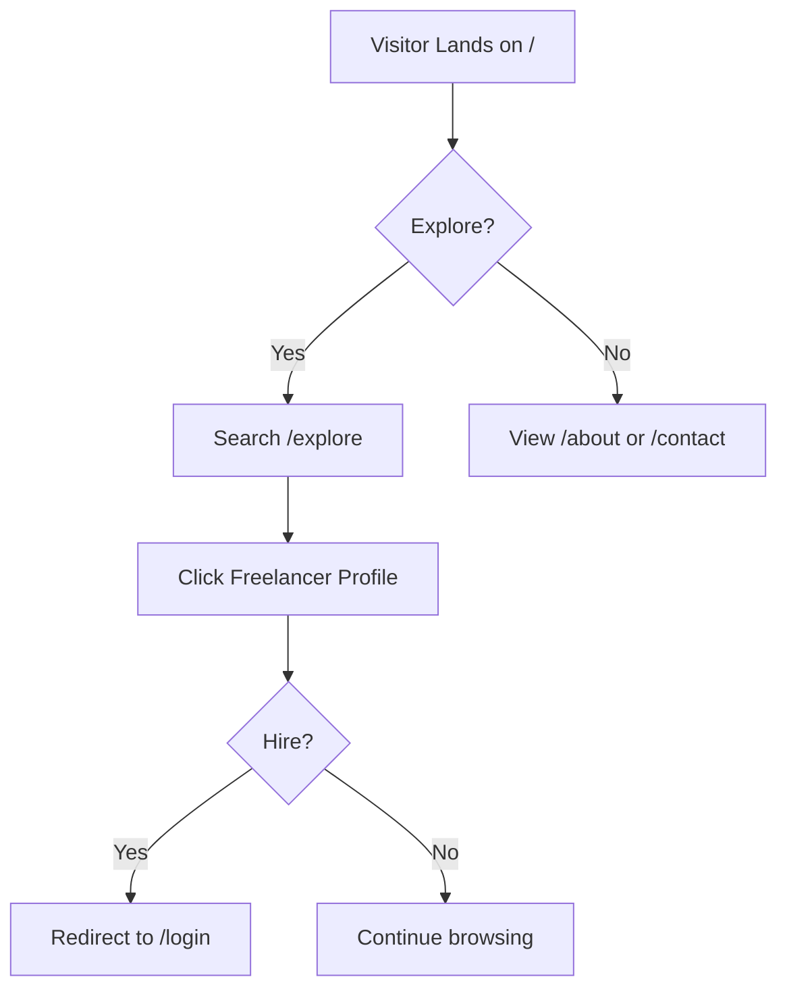
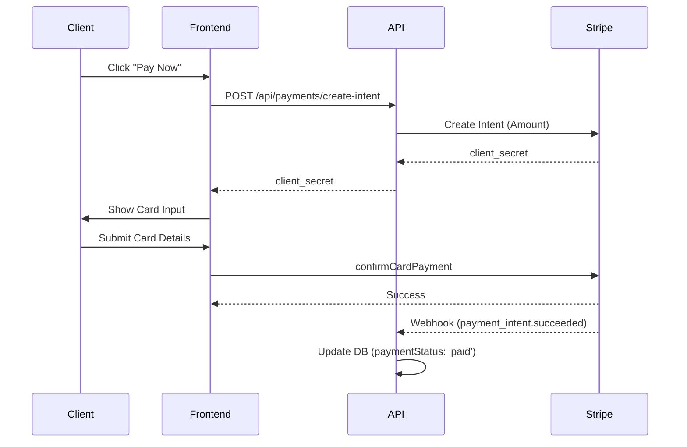

# Application Flow

This document maps out the end-to-end user journeys within SkillSync, from a visitor's first landing to complex contract negotiations and reviews. 

---

## 1. Public Discovery Flow

When a user first lands on SkillSync (unauthenticated), they are presented with public-facing discovery routes.

- **`/` (Landing Page):** Showcases hero graphics, top-level categories, featured skills, and trust badges.
- **`/explore` (Search):** The primary discovery engine. Unauthenticated users can search via text and filter by category or rate.
  - *Behind the scenes:* The frontend fetches `/api/search` which utilizes a MongoDB `$text` index to return a blended list of `users` and `projects`.
- **`/about` & `/contact`:** Informational pages. The contact form posts to `/api/contact` and saves the message to the database for admin review.
- **`/freelancers/[id]`:** Visitors can view public freelancer profiles (fetching `/api/users/[id]`), seeing their skills and reviews, but cannot initiate a booking without logging in.

---

## 2. Authentication Flow

SkillSync uses NextAuth v5 for authentication, supporting both OAuth (Google) and Credentials.

- **`/signup`:** Users select a role (`member` or `provider`), provide name, email, and password. 
  - *API:* `POST /api/auth/register` validates via Zod, hashes the password via `bcrypt`, creates the User document, and triggers a welcome email via Resend.
- **`/login`:** 
  - *Credentials:* Validates against the hashed password. 
  - *Google OAuth:* Automatically creates a User document if one doesn't exist (defaulting to `member` role).
- **`/forgot-password` & `/reset-password`:** Users request a reset link. 
  - *API:* `POST /api/auth/forgot-password` generates a secure crypto token, hashes it into the DB, and emails the raw token. `/api/auth/reset-password` validates the hash and updates the password.

---

## 3. The Freelancer (Provider) Journey

A user registered as a `provider` primarily focuses on setting up their profile, listing skills, and bidding on open projects.

### Profile Setup
- **`/dashboard/profile`:** The provider updates their headline, bio, hourly rate, and uploads an avatar (handled via `/api/upload` to Cloudinary).
  
### Creating a Skill
- **`/share-skill`:** The provider fills out a multi-step form detailing their offering.
  - *API:* `POST /api/skills` creates a `Skill` document linked to their `providerId`.

### Bidding on Projects
- The provider browses `/explore` and finds an open project.
- **`/projects/[id]`:** They view project details and click "Submit Proposal".
- **Proposal Submission:** They enter a message, rate, and timeline.
  - *API:* `POST /api/proposals` saves the proposal and dispatches an email notification to the project owner.

---

## 4. The Client (Member) Journey

A user registered as a `member` focuses on posting projects and hiring talent.

### Posting a Project
- **`/post-project`:** A multi-step form utilizing `react-hook-form`. Clients set budget (fixed/hourly), timeline, and upload attachments (Cloudinary).
  - *API:* `POST /api/projects` creates the `Project` document.

### Reviewing Proposals & Hiring
- The client views their project on `/dashboard/projects`. They see incoming proposals.
- **Accepting a Proposal:** 
  - *API:* `PUT /api/proposals/[id]` (status: `accepted`).
  - *Behind the scenes:* A Mongoose Transaction is initiated. It accepts the proposal, auto-rejects all other pending proposals for that project, creates a new `Contract` document, sets the Project status to `in_progress`, and emails the freelancer.

---

## 5. Contract & Payment Flow

Once a contract is formed, both parties monitor its status.

- **`/dashboard/contracts/[id]`:** The shared workspace for the contract.
- **Funding (Client):** 
  - The client must fund the contract. They click "Pay Now".
  - *API:* `POST /api/payments/create-intent` generates a Stripe `clientSecret`.
  - *Frontend:* The `CheckoutForm` component uses `@stripe/react-stripe-js` to securely collect card details.
  - *Webhook:* `POST /api/payments/webhook` listens for `payment_intent.succeeded` from Stripe, updates the Contract `paymentStatus` to `paid`, and sends an in-app notification to the freelancer.

---

## 6. Review Flow

- **Contract Completion:** When work is done, either party can mark the contract as `completed` via `PUT /api/contracts/[id]`. 
- **Notification:** This triggers an email and in-app notification prompting both parties to leave a review.
- **Leaving a Review:** 
  - *API:* `POST /api/reviews`. Validates the user is a party to the contract and hasn't reviewed yet (enforced by a compound unique index).
  - *Behind the scenes:* A post-save Mongoose hook calculates the new `averageRating` and saves it directly onto the target's `User` document.
