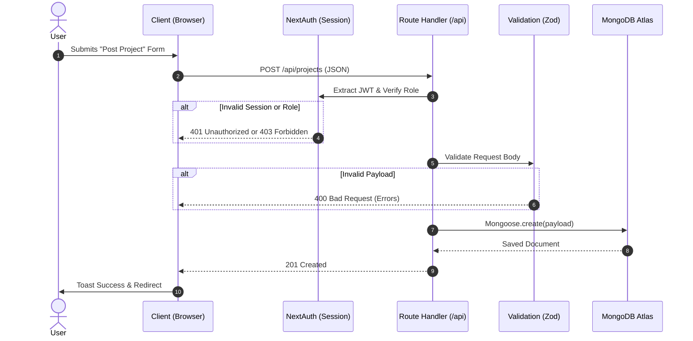
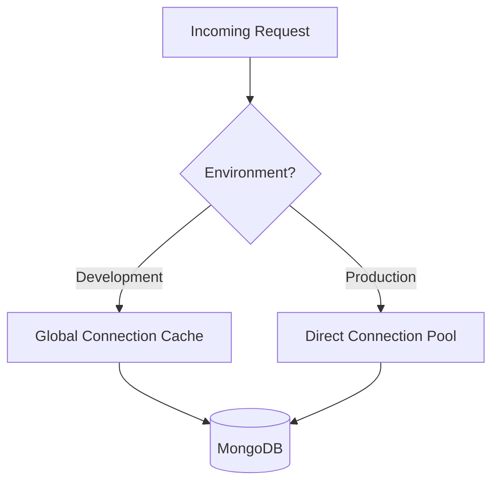

# 🏗️ System Architecture

SkillSync is designed as a **Serverless Monolith** leveraging the full power of the **Next.js App Router (v15)**. The architecture strictly separates data fetching (Server) from interactivity (Client) to ensure lightning-fast initial paints, superior SEO, and zero exposure of database credentials to the browser.

---

## 🏛️ High-Level Component Architecture

> [!NOTE]
> **Server vs. Client Boundary**
> We push `"use client"` directives to the absolute leaves of the component tree. A layout or page is almost always a Server Component, passing serialized data down to interactive Client Components like forms or buttons.

---

## 🔄 The Request Lifecycle

When a user interacts with the application, data flows through distinct layers ensuring security and validation.

---

## 🔑 Authentication Architecture (NextAuth v5)

Authentication uses a hybrid approach to maximize speed and security.

| Aspect | Implementation Details |
| :--- | :--- |
| **Strategy** | `jwt` (JSON Web Tokens) to prevent session database lookups on every request. |
| **Providers** | `Credentials` (Email/Password) and `Google OAuth`. |
| **Callbacks** | During the `jwt` callback, we inject the `user._id` and `user.role` into the token. |
| **Hydration** | The `session` callback exposes these minimal fields to the Client via `useSession()`. |

> [!TIP]
> **Why JWT?**
> Because SkillSync operates in a Serverless environment (Vercel), maintaining a persistent database connection for session validation on every route transition is too slow and resource-heavy. JWTs are cryptographically verified locally without hitting MongoDB.

---

## 💾 Database Access Pattern

We use **Mongoose 9** to interact with MongoDB.

> [!WARNING]
> **Connection Exhaustion Prevention**
> In Development (`npm run dev`), Next.js constantly clears the module cache on hot-reloads. If we didn't cache the Mongoose connection in `global._mongoose`, Next.js would spawn hundreds of idle connections until MongoDB rate-limits the IP.

### The Aggregation Pipeline Pattern
For complex reads (like the Dashboard or Explore page), we bypass simple `.find()` queries and utilize **Aggregation Pipelines**. This allows us to push heavy computation (sorting, grouping, `$facet` pagination) directly to the database engine rather than computing it in Node.js memory.
