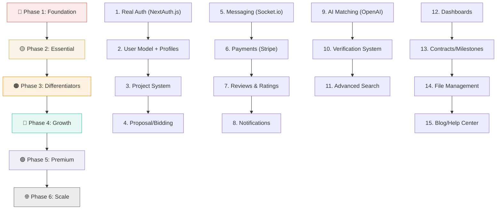

# SkillSync — Complete Feature Roadmap

> From prototype to production. This is every feature you need to build, organized by priority.

---

## What You Have Today vs. What You Need

```
┌──────────────────────────────────────────────────────────────────┐
│  CURRENT STATE                 │  TARGET STATE                  │
│                                │                                │
│  ✓ 8 static pages             │  Full dynamic web application  │
│  ✓ Mock auth (localStorage)   │  Real auth + sessions + OAuth  │
│  ✓ 4 hardcoded freelancers    │  Dynamic user-generated data   │
│  ✓ 2 API routes (contact,     │  20+ API routes covering       │
│    share-skill)                │  every platform feature        │
│  ✓ 2 Mongoose models          │  8-10 data models              │
│  ✗ No user database           │  Full user management          │
│  ✗ No real payments            │  Escrow + Stripe integration   │
│  ✗ No messaging               │  Real-time chat                │
│  ✗ No AI logic                 │  AI-powered matching engine    │
│  ✗ No dashboards              │  Client + Freelancer + Admin   │
│  ✗ No file handling            │  Upload, storage, delivery     │
│  ✗ No notifications            │  Email + in-app + push         │
│  ✗ No reviews/ratings         │  Verified review system        │
└──────────────────────────────────────────────────────────────────┘
```

---

## Phase 1: 🔴 Core Foundation (Build First — Nothing Works Without This)

These are non-negotiable. Every other feature depends on them.

---

### 1.1 Real Authentication System

**What you have:** Mock login — accepts any email/password, stores name in localStorage.
**What you need:**

| Feature | Description |
|---|---|
| **Email + Password Auth** | Signup with hashed passwords (bcrypt), login with JWT sessions |
| **Email Verification** | Send verification email on signup, block unverified accounts |
| **Password Reset** | "Forgot password" flow with email token link (the `/forgot-password` page you link to but doesn't exist) |
| **OAuth Integration** | Real Google & Facebook login (your buttons exist but say "not available") |
| **Session Management** | HTTP-only cookies with JWT or use NextAuth.js for production-grade sessions |
| **Role-Based Access** | Backend enforcement of learner/expert roles (currently only enforced on frontend) |
| **Account Deactivation** | Users can temporarily disable or permanently delete their account |

**Tech recommendation:** Use **NextAuth.js v5** (Auth.js) — it integrates perfectly with Next.js App Router and supports Google, Facebook, email/password, and magic links out of the box.

---

### 1.2 User Database & Profiles

**What you have:** No User model. No profile pages. User is just `{ name, role }`.
**What you need:**

| Feature | Description |
|---|---|
| **User Model** | Full schema: email, hashedPassword, name, avatar, bio, role, skills, location, timezone, hourlyRate, portfolio, socialLinks, joinDate, lastActive, isVerified, etc. |
| **Profile Page** (`/profile/[id]`) | Public profile showing name, bio, skills, portfolio, ratings, completed projects, availability status |
| **Edit Profile** (`/settings/profile`) | Form to update all profile fields, upload avatar |
| **Portfolio Section** | Freelancers can showcase past work with images, descriptions, and external links |
| **Availability Status** | Freelancers can set "Available", "Busy", "Not Taking Work" — visible to clients |
| **Skill Endorsements** | Other users can endorse specific skills (like LinkedIn) |
| **Profile Completion** | Progress bar showing how complete a profile is — encourages users to fill everything out |

---

### 1.3 Project System (The Core Loop)

**What you have:** Post Project page is UI-only (no form submission, pricing stuck at $0). Hire Talent shows 4 hardcoded freelancers.
**What you need:**

| Feature | Description |
|---|---|
| **Project Model** | Schema: title, description, category, skills required, budget (fixed/hourly), duration, complexity, attachments, status (open/in-progress/completed/cancelled), clientId, freelancerId, milestones, createdAt |
| **Create Project API** | `POST /api/projects` — validates and saves project to DB, linked to authenticated user |
| **Project Listing Page** (`/projects`) | Browse all open projects with search, filter (category, budget range, duration, skills), and sort |
| **Project Detail Page** (`/projects/[id]`) | Full project details, proposal submission form, similar projects |
| **My Projects Dashboard** | For clients: list of their posted projects with status filters |
| **Project Status Workflow** | `Draft → Open → In Review → In Progress → Completed → Closed` |
| **Project Invitations** | Clients can directly invite specific freelancers to their project |

---

### 1.4 Proposal / Bidding System

**What you have:** Nothing — the "Hire" button on freelancer cards does nothing.
**What you need:**

| Feature | Description |
|---|---|
| **Proposal Model** | Schema: projectId, freelancerId, coverLetter, proposedBudget, estimatedDuration, attachments, status (pending/accepted/rejected/withdrawn), createdAt |
| **Submit Proposal** | Freelancers can bid on open projects with a custom cover letter and price |
| **Proposal Management** | Clients see all proposals for their project, can compare, shortlist, accept, or reject |
| **Proposal Counter-offers** | Client can negotiate price/timeline back and forth |
| **Proposal Limit** | Freelancers can only submit X proposals per day/week (prevents spam) |
| **Accept & Start** | When client accepts a proposal, project status changes to "In Progress" and a contract is created |

---

## Phase 2: 🟡 Essential Platform Features (Makes It Usable)

---

### 2.1 Real-Time Messaging

**What you have:** Nothing — no way for users to communicate.
**What you need:**

| Feature | Description |
|---|---|
| **Chat System** | 1-on-1 real-time messaging between client and freelancer |
| **Message Model** | Schema: conversationId, senderId, receiverId, content, attachments, readAt, createdAt |
| **Conversation List** (`/messages`) | List of all conversations with last message preview, unread count |
| **Chat Window** | Real-time chat UI with typing indicators, message status (sent/delivered/read) |
| **File Sharing in Chat** | Send images, documents, code snippets within chat |
| **Chat Notifications** | In-app badge + email notification for new messages |
| **Pre-project Enquiry** | Users can message before hiring to discuss requirements |

**Tech recommendation:** Use **Socket.io** or **Pusher** for real-time, or **Supabase Realtime** if you switch to Supabase.

---

### 2.2 Payment & Escrow System

**What you have:** Pricing UI exists but is non-functional ($0). No payment integration.
**What you need:**

| Feature | Description |
|---|---|
| **Stripe Integration** | Connect Stripe for payment processing |
| **Escrow System** | When client hires, funds are held in escrow until milestone completion |
| **Milestone Payments** | Projects can be split into milestones, each with its own payment |
| **Release Payment** | Client approves milestone → funds released to freelancer |
| **Dispute Handling** | If client/freelancer disagree, admin mediates and decides fund release |
| **Payment History** | Both parties can view all transactions, invoices, receipts |
| **Freelancer Payouts** | Freelancers can withdraw to bank/PayPal, with minimum threshold |
| **Platform Fee** | SkillSync takes X% commission per transaction (revenue model) |
| **Invoicing** | Auto-generated invoices for every payment |

**Tech recommendation:** **Stripe Connect** — specifically designed for marketplace platforms with escrow.

---

### 2.3 Review & Rating System

**What you have:** Hardcoded 5-star ratings on freelancer cards. No actual review submission.
**What you need:**

| Feature | Description |
|---|---|
| **Review Model** | Schema: projectId, reviewerId, revieweeId, rating (1-5), comment, categories (communication, quality, timeliness, value), createdAt |
| **Post-Project Reviews** | After project completion, both client AND freelancer review each other |
| **Review Prompts** | System prompts users to leave reviews after project ends |
| **Review Display** | Show on profiles with breakdown by category |
| **Review Response** | Reviewed user can post ONE response to a review |
| **Review Moderation** | Admin can flag/remove inappropriate reviews |
| **Aggregate Ratings** | Calculate and display average ratings, total reviews, rating distribution |
| **Verified Badge** | Reviews linked to real completed projects — can't fake them |

---

### 2.4 Notification System

**What you have:** Toast notifications (local, disappear on refresh). No persistent notifications.
**What you need:**

| Feature | Description |
|---|---|
| **In-App Notifications** | Persistent notification center (bell icon) with read/unread status |
| **Email Notifications** | Transactional emails: new proposal, message, payment, project update |
| **Notification Preferences** | Users choose what emails they receive (per-category toggle) |
| **Push Notifications** | Browser push for real-time alerts when tab is closed |
| **Notification Types** | New proposal, proposal accepted/rejected, new message, payment received, project completed, review received, account update |

**Tech recommendation:** **Resend** or **SendGrid** for transactional emails. **Web Push API** for browser push.

---

## Phase 3: 🟠 Differentiating Features (What Makes SkillSync Special)

---

### 3.1 AI-Powered Matching Engine

**What you have:** "AI-powered matching" mentioned everywhere in copy — zero actual AI code.
**What you need:**

| Feature | Description |
|---|---|
| **Skill Analysis** | When a project is posted, AI extracts required skills, complexity level, and estimated effort |
| **Freelancer Scoring** | Score each freelancer against a project based on: skill match %, past project similarity, ratings, availability, price range |
| **Smart Recommendations** | "Recommended for you" section on freelancer dashboard showing best-fit projects |
| **Project Brief Analysis** | Upload a document → AI extracts requirements, generates structured project brief automatically |
| **Intelligent Pricing** | Based on project complexity, skill demand, and market rates, suggest a fair price range |
| **Skill Gap Analysis** | Show freelancers what skills are in demand that they don't have yet |

**Tech recommendation:** Use **OpenAI API** (GPT-4) for text analysis and brief generation. Build a custom scoring algorithm for matching. Consider **vector embeddings** (via Pinecone or Supabase pgvector) for semantic skill matching.

---

### 3.2 Freelancer Verification & Trust System

| Feature | Description |
|---|---|
| **Identity Verification** | Upload government ID for verified badge |
| **Skill Tests** | Built-in coding/design challenges to verify skills (like HackerRank integration) |
| **Portfolio Verification** | Link GitHub, Dribbble, Behance to auto-import verified work |
| **Background Check Badge** | Optional paid background check for premium freelancers |
| **Trust Score** | Composite score based on: profile completion, verification level, ratings, response time, completion rate |
| **Top Rated Badge** | Automatic badge for freelancers maintaining 4.8+ rating across 10+ projects |
| **Rising Talent Badge** | Badge for new freelancers who complete their first 3 projects with excellent reviews |

---

### 3.3 Advanced Search & Discovery

**What you have:** A search input and filter button on Hire Talent — neither works.
**What you need:**

| Feature | Description |
|---|---|
| **Full-Text Search** | Search freelancers by name, skills, bio, location |
| **Advanced Filters** | Filter by: category, skills, hourly rate range, rating, location, availability, experience level |
| **Sort Options** | Sort by: relevance, rating, price (low-high, high-low), most reviews, newest |
| **Save Searches** | Save frequently used search criteria |
| **Saved Freelancers** | Bookmark freelancers to a "Favorites" list |
| **Search Suggestions** | Auto-suggest skills and categories as user types |
| **Recent Views** | "Recently Viewed Freelancers" section |

**Tech recommendation:** **MongoDB Atlas Search** (built into MongoDB) for full-text search with faceted filters. Or **Algolia** for blazing-fast search.

---

## Phase 4: 🔵 Growth & Engagement Features

---

### 4.1 User Dashboard (The Command Center)

**What you have:** No dashboard. Users land on the home page after login.
**What you need:**

| Dashboard | Features |
|---|---|
| **Client Dashboard** (`/dashboard/client`) | Active projects, pending proposals, recent messages, spending overview, recommended freelancers |
| **Freelancer Dashboard** (`/dashboard/freelancer`) | Active gigs, available projects matching skills, earnings overview, pending reviews, profile views analytics |
| **Earnings Analytics** | Charts showing earnings over time, earnings by category, top clients |
| **Project Analytics** | Completion rate, average project duration, average rating received |
| **Quick Actions** | "Post a Project", "Update Availability", "Withdraw Funds" buttons |

---

### 4.2 Contract & Milestone Management

| Feature | Description |
|---|---|
| **Contract Generation** | When proposal is accepted, auto-generate a contract with terms, timeline, milestones |
| **Milestone Tracker** | Visual progress bar showing milestone completion |
| **Milestone Submission** | Freelancer submits deliverables for each milestone |
| **Milestone Approval** | Client reviews and approves/requests revisions for each milestone |
| **Time Tracking** | For hourly projects, built-in time tracker with activity screenshots (like Upwork) |
| **Work Diary** | Hourly log showing what was worked on with timestamps |
| **Deadline Alerts** | Notifications when milestones are approaching deadline |

---

### 4.3 File Management & Deliverables

**What you have:** Upload areas exist visually in Post Project but are non-functional.
**What you need:**

| Feature | Description |
|---|---|
| **File Upload** | Upload project briefs, portfolios, deliverables (images, PDFs, ZIPs, code) |
| **Cloud Storage** | Store files on **AWS S3** or **Cloudinary** |
| **File Versioning** | Track versions of deliverables (v1, v2, v3...) |
| **Project Files Section** | Dedicated files tab within each project |
| **Secure Downloads** | Time-limited download links for sensitive files |
| **Image Preview** | Preview images/PDFs in-browser without downloading |
| **Storage Limits** | Free tier: 500MB, Pro: 5GB (monetization opportunity) |

---

### 4.4 Blog / Knowledge Base

| Feature | Description |
|---|---|
| **Blog Section** (`/blog`) | Articles about freelancing, hiring tips, skill development |
| **SEO Content** | Drives organic traffic to the platform |
| **Freelancer Guides** | "How to write a great proposal", "Setting your rate" |
| **Client Guides** | "How to write a project brief", "Evaluating proposals" |
| **FAQ / Help Center** | Common questions with search functionality |

---

## Phase 5: 🟣 Advanced & Premium Features

---

### 5.1 Premium / Subscription Tiers

| Feature | Description |
|---|---|
| **Free Tier** | Basic access: 3 proposals/month, standard search, basic profile |
| **Pro Freelancer** ($X/mo) | Unlimited proposals, featured in search, priority support, analytics dashboard, lower commission |
| **Business Client** ($X/mo) | Unlimited project posts, team accounts, dedicated account manager, advanced analytics |
| **Boosted Profiles** | Pay to appear at top of search results for X days |
| **Featured Projects** | Pay to highlight project listing for more proposals |

---

### 5.2 Team & Organization Features

| Feature | Description |
|---|---|
| **Team Accounts** | Companies can have multiple team members under one account |
| **Role Permissions** | Admin, Manager, Viewer roles within a team |
| **Team Billing** | Centralized billing for all team projects |
| **Team Dashboard** | Overview of all projects, freelancers, and spending across the team |
| **Shared Freelancer Pool** | Bookmark and share freelancer profiles within the team |

---

### 5.3 Advanced Analytics & Insights

| Feature | Description |
|---|---|
| **Market Rate Insights** | "Average rate for React developers in your area is $75/hr" |
| **Skill Demand Trends** | "Python demand increased 23% this quarter" |
| **Competition Analysis** | "12 other freelancers in your category have similar rates" |
| **Earnings Forecasting** | Based on current pipeline, projected earnings for next month |
| **Client Spending Reports** | Export detailed spending reports for accounting |

---

### 5.4 Admin Dashboard

| Feature | Description |
|---|---|
| **User Management** | View, edit, suspend, delete any user account |
| **Project Moderation** | Review flagged projects, resolve disputes |
| **Review Moderation** | Approve, edit, remove reported reviews |
| **Platform Analytics** | Total users, active projects, revenue, growth charts |
| **Payout Management** | Process freelancer withdrawals |
| **Content Moderation** | Auto-flag inappropriate content / scam projects |
| **Commission Settings** | Configure platform fee percentages |
| **Feature Flags** | Toggle features on/off without deployment |

---

## Phase 6: 🌐 Scale & Polish

---

### 6.1 Performance & Infrastructure

| Feature | Description |
|---|---|
| **Server-Side Rendering** | Already using Next.js App Router — optimize for SSR where needed |
| **Database Indexing** | MongoDB indexes on frequently queried fields (skills, rating, location) |
| **API Rate Limiting** | Prevent abuse with rate limits on all endpoints |
| **Caching** | Redis caching for frequently accessed data (profiles, search results) |
| **CDN for Assets** | Serve images/files via CDN (Vercel Edge, Cloudflare) |
| **Error Monitoring** | Sentry integration for production error tracking |
| **Logging** | Structured logging for debugging and audit trails |
| **CI/CD Pipeline** | Automated testing and deployment |

---

### 6.2 Mobile Experience

| Feature | Description |
|---|---|
| **PWA (Progressive Web App)** | Install as app on mobile, offline support, push notifications |
| **Mobile-Optimized Chat** | Chat interface optimized for touch |
| **Mobile Notifications** | Push notifications on mobile browser |
| **Future: Native App** | React Native app sharing logic with web (long-term goal) |

---

### 6.3 Internationalization

| Feature | Description |
|---|---|
| **Multi-Currency** | Display prices in user's local currency |
| **Multi-Language** | English, Hindi, Spanish (i18n support) |
| **Timezone Handling** | Show deadlines in user's local timezone |
| **International Payments** | Support for different payment methods by region |

---

### 6.4 Legal & Compliance

| Feature | Description |
|---|---|
| **Terms of Service Page** | Currently a 404 — needs real content |
| **Privacy Policy Page** | Currently a 404 — needs real content |
| **GDPR Compliance** | Data export, data deletion requests, cookie consent |
| **Tax Documents** | Generate 1099/tax forms for freelancers (US) |
| **Content Policy** | Rules against spam, fraud, inappropriate content |

---

## Priority Execution Order

If I were building this, here's the exact order I'd implement:



---

## Tech Stack Recommendations for New Features

| Need | Recommended Tech | Why |
|---|---|---|
| **Auth** | NextAuth.js v5 (Auth.js) | Purpose-built for Next.js, supports all providers |
| **Database** | MongoDB Atlas (already have) | You're already using Mongoose — keep it |
| **Real-Time Chat** | Socket.io or Pusher | WebSocket-based real-time messaging |
| **Payments** | Stripe Connect | Built for marketplace escrow payments |
| **File Storage** | AWS S3 or Cloudinary | Scalable file storage with CDN |
| **Email** | Resend or SendGrid | Transactional email service |
| **AI/ML** | OpenAI API (GPT-4) | Project brief analysis, skill matching, pricing suggestions |
| **Search** | MongoDB Atlas Search or Algolia | Full-text search with filters |
| **Caching** | Redis (Upstash) | Serverless Redis for caching |
| **Error Tracking** | Sentry | Production error monitoring |
| **Analytics** | Vercel Analytics + PostHog | Usage analytics and feature flags |

---

## Summary by the Numbers

| Category | Feature Count |
|---|---|
| 🔴 Core Foundation | **18 features** |
| 🟡 Essential Platform | **28 features** |
| 🟠 Differentiators | **19 features** |
| 🔵 Growth & Engagement | **22 features** |
| 🟣 Premium | **14 features** |
| 🌐 Scale & Polish | **16 features** |
| **Total** | **117 features** |

> [!IMPORTANT]
> You don't need to build all 117 features. **Phase 1 + Phase 2 (46 features)** will give you a fully functional MVP that real users can actually use. Everything after that is growth and differentiation.

> [!TIP]
> Start with **real authentication** — literally everything else depends on knowing who the user is. Then User profiles → Project system → Proposals → Messaging → Payments. That's your critical path to a working marketplace.
